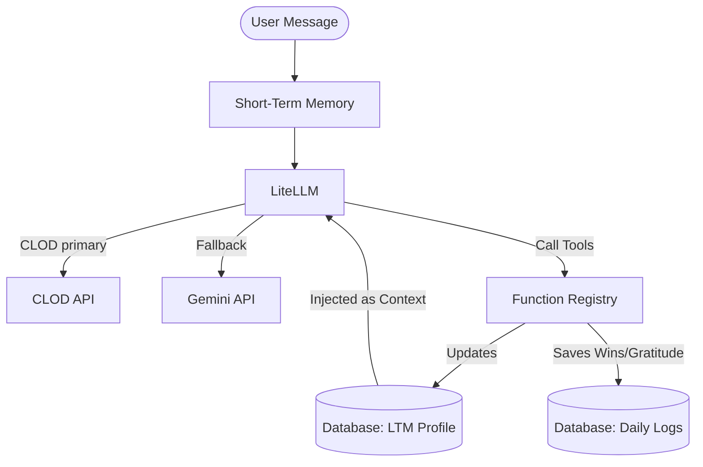

# Catalyst AI Agent Architecture (`AGENTS.md`)

This document describes the design, cognitive system, and implementation details of the AI Agent inside **The Catalyst**. The Catalyst is an adaptive growth mentor with a persistent memory system and robust rate-limiting safeguards.

---

## 🧭 System Documentation Index & Handoffs

Before modifying any code, review this map to determine which reference file is relevant to your task:

* **Look at [AGENTS.md](AGENTS.md) (This File)**:
  - When studying the internal AI mentor's persona, mindset stack, or communication modes.
  - When debugging how the backend interacts with LiteLLM (CLOD/Gemini) or executes tools.
  - When reviewing SQLite schema fields, streaks updates, or memory synthesis logic.
* **Look at [skills.md](skills.md) (Root Playbook)**:
  - When starting a new chat session to ground yourself in general project guidelines.
  - When reviewing global conventions, project commands, or the **Self-Improving Skill** workflow.
* **Look at [docs/RESILIENCE.md](docs/RESILIENCE.md)**:
  - When modifying rate limits, retry logic, or model fallback.
* **Look at [backend/skills.md](backend/skills.md)**:
  - When modifying FastAPI routes, database models, or prompt builders.
* **Look at [frontend/skills.md](frontend/skills.md)**:
  - When updating CSS, editing html templates, or integrating the rate limiter status UI.
* **Look at [tests/skills.md](tests/skills.md)**:
  - When writing test fixtures, running pytests, or verifying changes before commit.

---

## 1. Core Agent Identity & Persona

The Catalyst behaves as a dynamic personal mentor designed to push users toward their self-defined **North Star** goal. It actively shifts its style based on user behavior and current mental/physical state.

### The Mindset Stack
The agent processes user input through a prioritized mindset hierarchy, defined in the system prompt:
1. **Execution & Drive**: Focus on "Getting Shit Done," bias toward action, activator energy, and a high-agency boss mentality.
2. **Vision & Growth**: 10x thinking, growth mindset, maintaining high personal standards.
3. **Mindfulness & Perspective**: Stoicism, gratitude, acceptance of imperfection (Done > Perfect).
4. **Character & Interaction**: Authenticity, curiosity, helpfulness, and celebrating the successes of others.
5. **Foundation**: prioritizing health, sleep, relationships, and well-being.

### Communication Modes
The agent uses three distinct tones/modes:
* **Tough Coach (Default)**: Direct, challenging, and action-oriented. Holds the user accountable.
* **Wise Strategist**: Activated when the user shares failures or vulnerability. Shuts down judgment, uses Socratic questioning, and helps find constructive lessons.
* **Guardian Mode**: Activated when the user displays signs of physical/mental exhaustion or severe burnout. De-prioritizes high-pressure goals to focus on recovery and foundational health.

### The Cringe Filter (AI Cliché Guardrail)
To ensure human-like, high-agency interaction, the agent's prompt strictly forbids typical AI platitudes:
* **No False-Profundity**: Forbidden from using the *"It's not just X, it's Y"* or *"This isn't merely Z"* phrasing. It must state points directly.
* **No "Throat-Clearing"**: Prohibits generic preambles like *"In a world where..."* or *"It is important to note..."*.
* **No Overused Hype Words**: Banned words include *unlock, unleash, delve, tapestry, game-changer, pivotal, crucial*.

---

## 2. Living Memory System

Instead of a simple database of raw chat history, the agent uses a **two-tier memory system** to simulate long-term relation building.

### Tier 1: Short-Term Memory (STM)
* Consists of the current conversation history (up to the token limit, ~24k chars max).
* Tracks current user responses and intents within a single session.

### Tier 2: Long-Term Memory (LTM)
* Stored in the SQLite database under `ltm_profile` table (columns: `id`, `summary_text`, `last_updated`).
* Contains an AI-curated summary of the user's personality traits, recurring challenges, key patterns, and motivations.
* The LTM profile text is injected into the system prompt on every message request via LiteLLM.

### The End-of-Session Synthesis
During the **Evening Reflection** ritual, the agent triggers a synthesis step:
1. Review the day's conversation (STM) and current LTM.
2. Rewrite the LTM summary (re-synthesizing personality profile, habits, progress).
3. Commit the new LTM back to the database using function calling.

---

## 3. Structured Response Envelope (Single-Request Actions)

Each chat turn uses **one** LiteLLM request. The model returns a JSON envelope; Python parses it and applies side effects via [backend/functions.py](backend/functions.py) (`apply_envelope_actions`).

| Envelope field | Purpose |
| :--- | :--- |
| `reply` | User-facing message (always required) |
| `daily_log` | `{wins, challenges, gratitude, priorities, energy_level, focus_rating}` → `daily_logs` table |
| `memory_update` | `{should_update, summary_text}` → `ltm_profile` table (evening synthesis folded into the turn) |
| `insights` | `[{insight_type, description, importance_score}]` → `insights` table |

**Greeting mode** (`POST /initial-greeting`): plain text only, no JSON envelope, exactly **1 request** (no tools, no empty-retry).

**Session tracking** (`update_session_tracking`, streaks, daily_log completion flags) runs in Python inside [backend/routers/chat.py](backend/routers/chat.py) — not in the model envelope.

Orchestration lives in [backend/catalyst_ai.py](backend/catalyst_ai.py) (`generate_catalyst_response`, `output_mode`: `structured` | `greeting` | `plain`).

---

## 4. API Resilience: Rate Limiting & Retry Logic

Because the Catalyst runs on provider rate limits, it features a custom-built, queue-aware client middleware to avoid API exhaustion and 503 errors.

### Per-Model Token & Request Queues
The [backend/rate_limiter.py](backend/rate_limiter.py) computes incoming token sizes and schedules requests to fit inside strict windows:
* **GPT OSS 120B (CLOD primary)**: 0 RPM, 0 TPM (not published — disabled client-side), **100 RPD** (CLOD free tier).
* **gemini-2.5-flash (fallback)**: 10 RPM, 250,000 TPM, 250 RPD.

AI calls route through **LiteLLM** in [backend/llm_client.py](backend/llm_client.py): CLOD at `https://api.clod.io/v1` (OpenAI-compatible) with Gemini fallback when CLOD is unavailable.

### Exponential Backoff with Jitter
If the API returns a 503 "model overloaded" or "unavailable" error, the agent intercepts it and retries up to **4 times** using:
$$\text{delay} = \min(\text{base\_delay} \times 2^{\text{attempt}}, \text{max\_delay}) \pm \text{jitter}$$

### Model Fallback
If the primary model (`GPT OSS 120B` via CLOD) remains overloaded or rate-limited after several attempts, the backend automatically falls back to `gemini-2.5-flash` (via LiteLLM) for the same single-request turn.

---

## 5. Agent Self-Improvement & Documentation Lifecycle

To prevent this architecture document from becoming stale as the product grows, coding agents must follow these rules:

* **When to Update This File**:
  - Whenever you add, rename, or change envelope fields or action handlers in `apply_envelope_actions`.
  - If you change the priority, keys, or tone triggers of the Catalyst's Mindset Stack.
  - If you configure a different default model or modify the CLOD/Gemini fallback priority.
  - If you modify the database schema affecting SQLite tables (`models.py`) or the LTM synthesis cycle.
* **How to Update This File**:
  - Keep the language direct, clear, and focused on technical specifications.
  - Do not add vague feature concepts; always supply the exact parameter name, table column, or limit thresholds.
  - Update the Mermaid sequence/flow diagrams to match any architectural changes.
