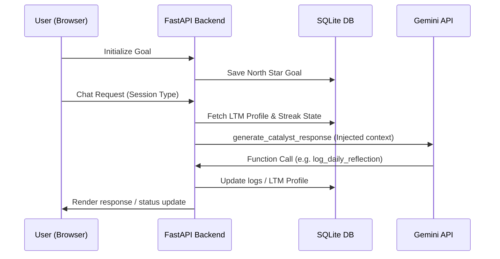

# The Catalyst - Project Plan & Technical Review (`PLAN.md`)

This document reviews the initial brief, details the completed technical implementation, and outlines the roadmap for future enhancements.

---

## 1. Core Mindset & Persona (Delivered)

The core Catalyst persona has been fully realized using the Gemini API.

- **Status**: ✅ **Implemented & Verified**
- **Details**:
  - The **Mindset Stack** prioritizes high-agency drive, 10x thinking, mindfulness (Done > Perfect), character growth, and structural foundations (health, sleep).
  - Tone switching logic operates automatically between **Tough Coach** (holding the user accountable) and **Wise Strategist** (curious, non-judgmental feedback during setbacks).
  - The **Cringe Filter** actively strips out typical AI platitudes and artificial enthusiasm.

---

## 2. Technical Architecture & Loop (Delivered)

The user journey and daily loop are managed through a single FastAPI application.

- **Status**: ✅ **Implemented & Verified**
- **Details**:
  - **FastAPI Backend**: Serves endpoints for initialization, chat processing, stats, and health checks.
  - **SQLite Database**: Models goals, daily reflection summaries, streaking metrics, and long-term memory.
  - **Uvicorn Server Wrapper**: Running `python app.py` launches both the backend and serves the frontend locally.

---

## 3. The Living Memory System (Delivered)

The system avoids simple raw chat logs by employing dynamic memory synthesis.

- **Status**: ✅ **Implemented & Verified**
- **Details**:
  - **Short-Term Memory (STM)**: Handles in-session conversational flow.
  - **Long-Term Memory (LTM)**: Curated profile stored as structured Markdown in the database.
  - **Evening Synthesis**: Every evening check-in triggers a synthesis function. The agent inspects the day's STM, merges it with the current LTM, and updates the database using function calling.

---

## 4. API Resilience (Delivered)

Custom rate limiter and retry logic prevent service disruption.

- **Status**: ✅ **Implemented & Verified**
- **Details**:
  - Enforces RPM and TPM limits for `gemini-2.5-pro` and `gemini-2.5-flash` models.
  - Handles temporary 503 errors using exponential backoff with jitter.
  - Switches models dynamically (falling back to Flash) if the primary model is overloaded.

---

## 5. Future Roadmap

These items are planned for the next iterations of The Catalyst:

### Phase A: Frontend UX Improvements
- [ ] Fully integrate the `enhanced_rate_limit_ui.js` with the main chat view to display user-friendly warnings during API waiting states.
- [ ] Build a floating API status dashboard displaying current TPM/RPM usage.

### Phase B: Advanced Features
- [ ] Add Voice Interaction support using WebRTC.
- [ ] Enable multi-goal tracking and goal hierarchies (sub-tasks).
- [ ] Implement productivity tool integrations (e.g., Google Calendar, Todoist) to sync daily priorities.
- [ ] Integrate visual dashboard graphs showing streak historical trends and energy/focus ratings.
